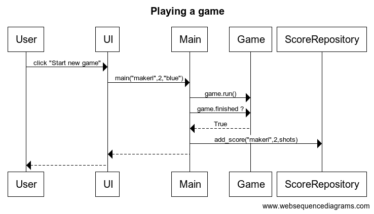

# Arkkitehtuurikuvaus

## Rakenne

Ohjelman rakennetta kuvaava pakkauskaavio on seuraavanlainen:

Pakkaus ui sisältää valikkoon liittyvät visuaaliset komponentit, pakkaus services sisältää sovelluslogiikasta huolehtivat komponentit, pakkaus entities taas sisältää pelin sisäiset oliot ja pakkaus repositories sisältää tiedon tallentamisesta vastuussa olevat toiminnallisuudet.

## Käyttöliittymä

Peli sisältää neljä erilaista näkymää:

- Aloitusvalikko
- Peli
  - Pelin loppunäyttö
- Tuloshistoria

Aloitusvalikosta voi asettaa itselleen nimimerkin, valita tason ja pallon värin sekä aloittaa uuden pelin. Valikko on toteutettu omana `Menu` -luokkanaan.

Pelinäkymässä lyödään minigolfille ominaiseen tapaan palloa reikään. Pelinäkymä rakentuu useasta luokasta, joista osa vastaa pelin logiikasta ja osa pygamen visuaalisista elementeistä. Pelin suorittamisesta vastaa pääasiassa `Game` -luokka, joka kutsuu muiden luokkien metodeita pelin tapahtumien perusteella.

Onnistuuneen pelisuorituksen jälkeen näytetään itsestään sulkeutuva loppunäyttö, joka kertoo pelin tuloksen. Loppunäyttö on toteutettu pygamella `EndScreen` -luokassa.

Pelin aloitusvalikosta voi avata myös oman ikkunan tulosten tarkastelua varten. Tuloksia voi suodattaa joko pelaajan tai kentän mukaan. Tulosten näyttämisestä vastaava `ScoreViewer` -luokka hyödyntää `ScoreRepository` -luokan metodeja päästäkseen käsiksi tuloksiin tietokannassa.

## Tietojen tallentaminen

`ScoreRepository` -luokka huolehtii tietojen tallentamisesta SQLite-tietokantaan. Tietokantaan tallennetaan jokaisen pelatun pelin jälkeen pelaajan nimi, tulos ja kentän numero.

### Tietokanta

Tietokantatiedoston nimi on määritelty [.env](https://github.com/makeri89/Ohjelmistotekniikka/blob/main/minigolf-game/.env) -tiedostossa, joten sitä on tarvittaessa hyvin kätevää vaihtaa.

Tietokannassa tiedot tallennetaan `scores` -tauluun, joka on seuraavanlainen:

| level | player |  score |
| :---: | :----: | :----: |
|   1   | makeri |   3    |
|   2   | makeri |   5    |

Tietokanta alustetaan [initialize-db.py](https://github.com/makeri89/Ohjelmistotekniikka/blob/main/minigolf-game/src/initialize_db.py) -tiedostossa.

## Toiminnallisuudet

### Pelin pelaaminen onnistuneesti

Kun aloitusvalikossa pelaaja syöttää nimimerkikseen 'makeri', valitsee tason 2 ja sinisen pallon, etenee pelin pelaaminen näin:

Kun pelaaja painaa `Start new game` -painiketta, kutsutaan `main`-funktiota annetuilla tiedoilla pelaajan nimestä, tasosta ja pallon väristä. `main`-funktio luo uuden `Game` -luokan olion, jonka sisällä luodaan pelin pelaamiseen vaadittavat oliot. `Game` tarkistaa jatkuvasti, onko pallo päätynyt reikään eli onko peli päättynyt. Kun peli päättyy, se kutsuu `ScoreRepository` -luokan metodia `add_score`, joka tallentaa pelin tuloksen tietokantaan. Peli palaa takaisin aloitusvalikkoon.

Kuvausta on selkeytetty jättämällä kaaviosta pois useimpien Game-luokan käyttämien olioiden luominen.

### Tulosten tarkastelu

Kun pelaaja aloitusvalikossa painaa `View score history` -painiketta ja valitsee avautuvassa ikkunassa tulosten suodatuksen tasoon 2, etenee sovelluksen toiminta seuraavasti:

`View score history` -painiketta painettaessa kutsutaan `score_table.py` -tiedoston `open_table` -funktiota, joka luo uuden ikkunan tuloshistorialle `ScoreViewer` -luokalla. Oletuksena haetaan ensin kaikki tulokset tietokannasta ja näytetään ne käyttäjälle. Kun käyttäjä antaa jonkin suodatuskriteerin, tyhjennetään näyttö ja haetaan siihen uudet tiedot tietokannasta suodattimen perusteella käyttäen `ScoreRepository` -luokan metodeita.

## Rakenteeseen jääneet heikkoudet

Luokissa `ScoreViewer` ja `Menu` on hieman toisteista koodia TkInter-komponenttien tyylin määrittelyssä. Tämän voisi mahdollisesti korjata määrittelemällä erillisen TkInter-tyylin, jonka antaisi komponenteille. Myös pylint ilmoittaa tästä toisteisuudesta.

Muutamissa luokissa on myös turhan paljon attribuutteja, näistäkin pylint ilmoittaa. Kyseisiä luokkia olisi kenties hyvä jakaa useampaan luokkaan niiden selkiyttämiseksi, mutta toisaalta se kenties jakaisi osittain turhaan samaa toiminnallisuutta useampaan luokkaan.
