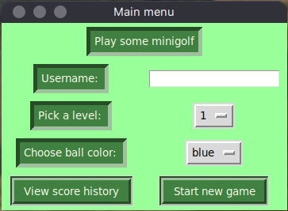

# Käyttöohje

Lataa projektin viimeisimmän [releasen](https://github.com/makeri89/Ohjelmistotekniikka/releases) lähdekoodi itsellesi.

Sen jälkeen siirry komentorivillä projektista löytyvään minigolf-game -kansioon. Suorita kaikki ohjelmaan liittyvät komennot sieltä.

## Konfigurointi

Pelien tulokset tallennetaan sqlite-tietokantaan. Voit halutessasi vaihtaa tuon paikallisen tietokantatiedoston nimeä muokkaamalla minigolf-game -kansiosta löytyvää _.env_ -tiedostoa. Jos vaihdat tiedoston nimeä, suosittelen säilyttämään _data/_ -alkuliitteen nimessä, jolloin tiedosto pysyy _data_ -kansiossa. Oletuksena tiedoston sisältö on seuraavanlainen:

```
DB=data/db.sqlite
```

## Ohjelman käynnistäminen

Ennen pelin ensimmäistä käynnistystä suorita seuraavat komennot

```
poetry install
```

```
poetry run invoke build
```

Näiden komentojen jälkeen pelin voi käynnistää komennolla

```
poetry run invoke start
```

## Pelin aloittaminen

Peli käynnistyy aloitusvalikkoon:



Pelin aloitus onnistuu syöttämällä nimesi ja painamalla "Start new game" -painiketta.

## Pelin pelaaminen

Peliympäristö näyttää seuraavalta:


Jokainen taso on tietenkin uniikki, kuvassa on taso numero 2.

Palloa voi lyödä klikkaamalla hiirellä haluamaasi kohtaa kentällä ja pallo liikkuu hiiren sijainnin suuntaan. Pallon nopeus on riippuvainen klikkauskohdan ja pallon sijainnin etäisyydestä. Mitä kauempaa palloa lyö, sitä nopeammin ja pidemmälle pallo liikkuu.

Jos pallo ajautuu siniseen vesiesteeseen, se palautuu automaattisesti alkuperäiseen lyöntipaikkaan.

Hiekalle ajautuessaan pallo hidastuu. Hiekkaa on kahta erilaista, vaaleammalla hiekalla hidastuminen ei ole yhtä voimakasta kuin tummalla hiekalla.

Kun pallo menee reikään, pelinäkymä sulkeutuu ja aloitusvalikko aktivoituu. Valikosta voi aloittaa suoraan uuden pelin.

## Tulosten tarkastelu

Muutaman pelin pelattuaan on hyvä nähdä omaa tuloshistoriaansa. Tuloksia pääsee tarkastelemaan päävalikosta `View score history` -painikkeella.

Tuloshistoria aukeaa omaan ikkunaansa:


Tuloksia voi suodattaa pelaajan nimellä syöttämällä nimen sille varattuun kenttään ja painamalla `Filter by player` -painiketta. Kentän mukaan tulosten suodatus onnistuu valitsemalla pudotusvalikosta haluttu kenttä ja painamalla `Filter by level` -painiketta.

Tuloslistan saa palautettua näyttämään kaikki tulokset `Reset` -painikkeella.
